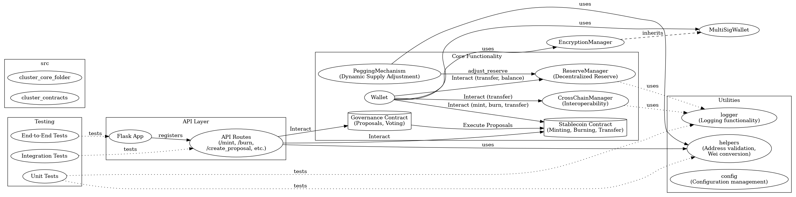

# System Architecture Overview

## Introduction

The **stable-pi-core** project is designed to create a stablecoin ecosystem that leverages advanced blockchain technology. This document provides an overview of the system architecture, including its components and interactions.

## Diagram 

 

## Architecture Components

### 1. Core Modules

- **Pegging Module**: Responsible for maintaining the value of Pi Coin at $314.159 through dynamic supply adjustments.
- **Reserve Management**: Manages a decentralized reserve of assets to back the stablecoin, ensuring liquidity and stability.
- **Wallet Module**: Provides user interfaces and functionalities for managing Pi Coin, including sending, receiving, and storing coins.

### 2. Smart Contracts

- **Stablecoin Contract**: Implements the logic for minting, burning, and transferring Pi Coin.
- **Governance Contract**: Facilitates decentralized governance, allowing stakeholders to propose and vote on changes to the protocol.

### 3. API Layer

- **RESTful API**: Exposes endpoints for wallet interactions, transaction processing, and querying blockchain data.

### 4. Frontend Interface

- **Web Application**: A user-friendly interface for interacting with the wallet and managing transactions.

## Data Flow

1. Users interact with the web application to perform transactions.
2. The frontend communicates with the API layer to process requests.
3. The API layer interacts with the core modules and smart contracts to execute the requested actions.
4. Data is stored on the blockchain, ensuring transparency and immutability.

## Conclusion

The architecture of **stable-pi-core** is designed to be modular, scalable, and secure, providing a robust foundation for the Pi Coin stablecoin ecosystem.
